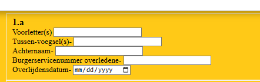
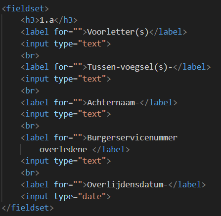
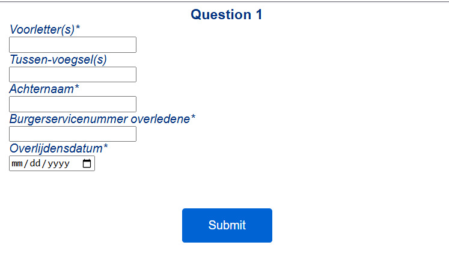

# BT

## color

De colors used by the NS website

### background color

**White**: #ffffff 
**White-shadow**: #fcfcfc 
**Yellow** : #ffc917 

### Text color

**Dark blue**: #003082 
**Blue**: #0068D4 

## fonts

- **NS Sans** – Regular (400) & DemiBold (600): At the office workplace (personal computer and printer), every NS employee has two NS house style fonts: ‘NS Sans’ and ‘NS Swift’. NS Sans is also used for other digital applications, such as web, mobile devices, screens, information screens at stations or in the train.
- **NS Sign**: NS Sign is a font with extra space between the letters. This improves the readability of texts at great distances. This font is used for moving information carriers or for signage of stations and NS buildings, public information signs, lettering of trains and company cars.
- **NS Logos**: This font contains the most important logos, such as NS and NedTrain.
- **NS One & Two**: NS One contains 179 functional icons for wagon indications, signage applications such as P+R, WC, bicycle shed, etc. NS Two contains 89 partner logos such as Hermes, Veolia and DB.
- **NS Swift**: Frutiger and Swift 2.0 are used for printing. This is a serif font.

Fonts found on the network but still need to add it to the git ignore

---

## progress

### wednesday march 5th

So this went to learning the basic of forms and undestanding the question. I am gonno be honest I had an hard time focusing on this project. it seams my new medication is making it more difficult.

While listening to the presentation while trying to fiure it out on my own. I created an basic website with the forms and recreated the questions from 1.a. As the first questions to take inspiration.

This day was also an day of me messing around with form and trying to figure it out as much as possible while trying to make the css.

### Thurseday march 6th

Working more on the questions, i finaly understood we only need to do questions that are interresting.

Questions 1.A as an beginner question and an start for me to work on sounded perfect beginner test for now.

Question 1.B with an function to ignore all other questions in that are part of question 1.B sounded good challage to move further upon.

Question 3.B seems like simular challange to 1.B but looked an little different. Thats why i wanted to work on it.

Question 4.C has an multiple choice input that i want to recreate as perfect as possible.

Question 4.D has most challanging form input for me at the moment. Since it has an fracture and percantile. I want it to respond to each other if one has input.

During the day i also made the website multiple pages and fixed bugs with this issue.

### Wednesday march 12

Today i changed the css of the website to make it look more like the NS website. I also added the NS logo to the website. and the NS button.

And i started to implement questions 1.B partialy. I mainly added an function to remove the rest of the questions when the user selects an specific option.

I also started to add the percentage question from 4.D. No function yet but i added the input.

### Thursday march 13

Today i added the function to the percentage question. So that it can calculate the percentage from your input.

I also gotten feedback from Jemery Keith. He told me that i need to change the way i use Display none or else user on an older device will not be able to see the questions. I will change this next week.

### Wednesday march 19

Today I tried adding an progress bar. I had an hard time with this. I tried to use the progress Atribute first but couldn't make it work properly. So i tried to do it in CSS all instead. And ended up with this.

